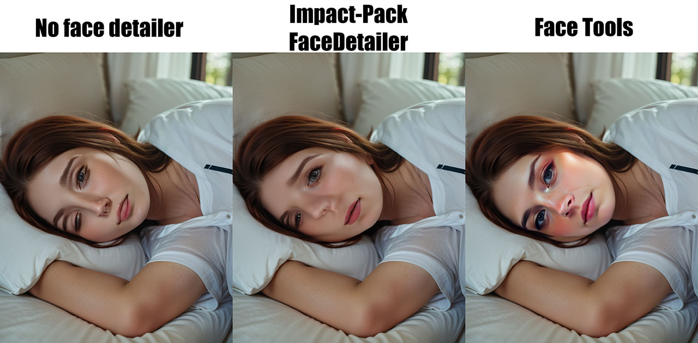
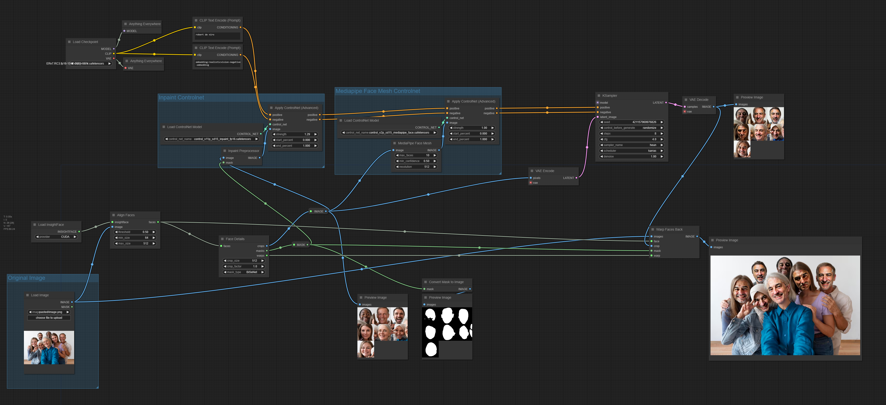

# comfyui_facetools

These custom nodes provide a rotation aware face extraction, paste back, and various face related masking options.

## Patch notes
- 2024-05-22 - Updated GenderFaceFilter node.
- 2024-05-19 - Added BiSeNetMask and JonathandinuMask nodes. Careful about JonathandinuMask, it's more accurate than BiSeNet, but it takes more memory; you can get out of memory more easily with it.
- 2024-03-10 - Added nodes to detect faces using `face_yolov8m` instead of `insightface`.

## Example Workflows
- Full inpainting workflow with two controlnets which allows to get as high as 1.0 denoise strength without messing things up.

## Nodes
- `AlignFaces`
  - inputs:
    - insightface: Use the `Load InsightFacenode` from [ComfyUI_IPAdapter_plus](https://github.com/cubiq/ComfyUI_IPAdapter_plus)
    - image
    - threshold: minimal confidence score for detection
    - min_size: minimum face size for detection
    - max_size: maximum face size for detection
  - outputs:
    - faces
- `FaceDetails`
  - inputs:
    - faces
    - crop_size: size of the square cropped face image
    - crop_factor: enlarge the context around the face by this factor
    - mask_type:
      - simple_square: simple bounding box around the face
      - convex_hull: convex hull based on the face mesh obtained with MediaPipe
      - BiSeNet: occlusion aware face segmentation based on [face-parsing.PyTorch](https://github.com/zllrunning/face-parsing.PyTorch)
  - outputs:
    - crops: square cropped face images
    - masks: masks for each cropped face
    - warps: 2x3 warp matrix to paste the cropped face back into the original image
- `WarpFacesBack`
  - input:
    - images: this is the original image
    - face 
    - crop: cropped face images
    - mask: masks for the cropped faces
    - warp: 2x3 warp matrix
- `OrderedFaceFilter`
  - works similarly to `ImpactSEGSOrderedfilter`
- `GenderFaceFilter`
  - needs more work, as InsightFace gender classifier isn't very accurate.
- `MergeWarps`
  - I made some changes in `FaceDetailer` and `WarpFacesBack` since I've created this one, so it probably doesn't work anymore. Needs more testing and more work.

## Installation
- Download [bluefoxcreation/FaceAlignment](https://huggingface.co/bluefoxcreation/FaceAlignment) model into `ComfyUI/models/landmarks`
- (Only if you want to use occlusion aware masks) Download [BiSeNet model](https://drive.google.com/open?id=154JgKpzCPW82qINcVieuPH3fZ2e0P812) into `ComfyUI/models/bisenet`

###### DEPRECATED:
- You need [ComfyUI-Impact-Pack](https://github.com/ltdrdata/) for `Load InsightFace` node and [comfyui_controlnet_aux](https://github.com/Fannovel16/comfyui_controlnet_aux) for MediaPipe library (which is required for convex_hull masks) and `MediaPipe Face Mesh` node if you want to use that controlnet.